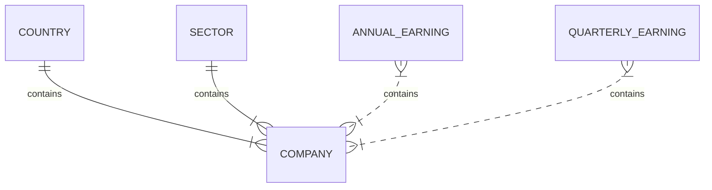

# ALPHAVANTAGE Tool

This tool consume information from Alphavantage.co,  
and returns information about companies as 
symbol, industry, description, quartery earns and annualy earns
consumig data from two different endopoints related with Overview and Earnings

## Database 

documentation  in /docs endpoint 
