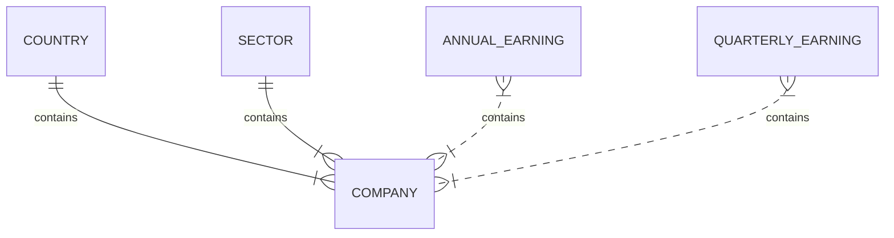

# ALPHAVANTAGE Tool

This tool consume information from Alphavantage.co,  
and returns information about companies as 
symbol, industry, description, quartery earns and annualy earns
consumig data from two different endopoints related with Overview and Earnings

## Database 
This database representation in code looks like this

This models are made like this, by now are not normalized, I expeted that alembic helps on that ... but no. 
This is a debd for next version

## Comany Summary
The company summary make queries to two differet endpoints 
[OVERVIEW](https://www.alphavantage.co/documentation/#company-overview)
[EARNINGS](https://www.alphavantage.co/documentation/#earnings)
The application has schemas to receibe company values, but are not implemented.

documentation  in /docs endpoint 
