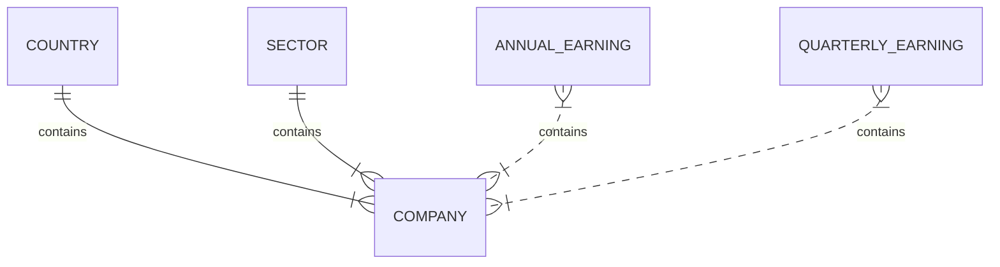

# ALPHAVANTAGE Tool

This tool consume information from Alphavantage.co,  
and returns information about companies as 
symbol, industry, description, quartery earns and annualy earns
consumig data from two different endopoints related with Overview and Earnings

## Database 
This database representation in code looks like this


This models are made like this, by now are not normalized, I expeted that alembic helps on that ... but no. 
This is a debd for next version

## Company Summary
The company summary make queries to two differet endpoints 
[OVERVIEW](https://www.alphavantage.co/documentation/#company-overview) and 
[EARNINGS](https://www.alphavantage.co/documentation/#earnings)

After get data from alphavantage API the application save some data into database. 
Use that data to return information about companies

***The application has schemas to receibe company values, but are not implemented.***


documentation  in endpoint  /docs endpoint 

## Run application
This application requires configure database for composer in  /higo.env.dev 
> See example on /example.higo.env.dev


### Use docker 
```
docker-compose -f docker-compose.yml build
docker-compose -f docker-compose.yml up -d
```
## ENV Variables
This project uses alembic, configurations at env.py
points to settings db url, and is always taked form 
os environment with names DATABASE_URL, same case for ALPHAVANTAGE_KEY
